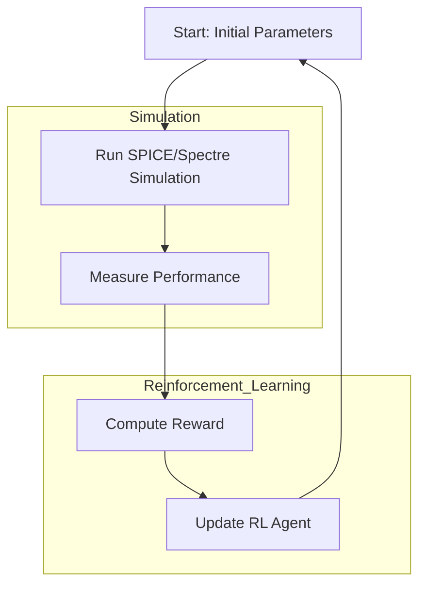

## Background

Analog integrated circuit (IC) design has long been considered a manual and expert-driven process, where experienced designers iteratively adjust parameters such as transistor widths, lengths, and compensation capacitors to meet performance specifications. As process nodes shrink and design complexity increases, the time and effort required for tuning circuit parameters also grow significantly.

Recent advances in **machine learning**, especially **reinforcement learning (RL)**, provide a promising opportunity to automate this parameter tuning process. In this project, we explore the integration of RL into analog IC design, using it to optimize the sizing of transistors and compensation capacitors in a two-stage operational amplifier (op-amp).

## Project Goals

This project aims to:

- Demonstrate the feasibility of using **deep reinforcement learning** to optimize analog circuit parameters.
- Build a reproducible framework that connects **simulation tools (e.g., NGSPICE, Spectre)** with an RL agent (e.g., PPO).
- Provide detailed theoretical and practical documentation to help future students and engineers replicate and understand the workflow.

## Key Features

- **Circuit Simulation**: We use industry-standard simulators such as NGSPICE and Cadence Virtuoso to evaluate circuit performance (e.g., gain, bandwidth).
- **RL Training**: We apply Proximal Policy Optimization (PPO) to learn the mapping from circuit configurations to performance metrics.
- **Parameter Space**: The optimization focuses on sizing parameters (`W/L`, `m`, `Cc`, etc.) under realistic constraints (e.g., 45nm/55nm CMOS process).
- **Scalability**: This framework is designed to be extended to more complex circuits with 100+ devices in future work.

## Project Structure

The rest of this documentation is organized as follows:

- [Setup Guide](./2024-04-12-setup.html): Instructions to install dependencies and run the simulation/training pipeline.
- [Theory](./2024-04-12-theory.html): A summary of the theoretical background (detailed explanation in the companion videos).
- [Design](./2024-04-13-design.html): Explanation of circuit structure and simulation setup.
- [Training](./2024-04-13-train.html): Overview of the RL agent and training procedure.
- [Results](./2024-04-14-results.html): Example results and analysis.
- [Others](./2024-04-15-others.html): Supplementary content.

---