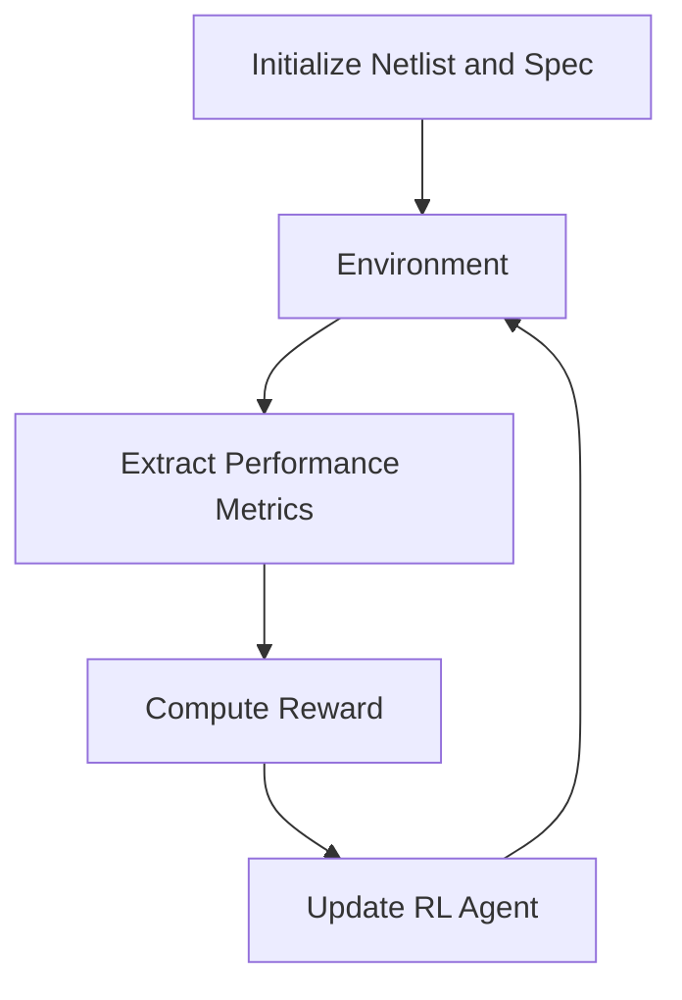

## 1. Introduction: Why Optimization in Analog Design?

Analog circuit design requires careful balancing of multiple conflicting performance metrics such as gain, bandwidth, phase margin, power, and area. Traditional design flows rely heavily on human expertise and iterative simulations, which do not scale well with increasing circuit complexity. As device sizes shrink and the design space expands, manual tuning becomes time-consuming and suboptimal.

To overcome these challenges, we model analog circuit parameter tuning as a **sequential decision-making problem**, which can be efficiently solved using **reinforcement learning (RL)**. RL agents can autonomously explore complex parameter spaces and learn optimal tuning strategies based on performance feedback from simulations.

## 2. Problem Formulation as a Markov Decision Process (MDP)

We define the optimization task as an MDP with the following components:

- **State ($s_t$):** Encodes current circuit behavior, such as performance metrics (gain, bandwidth, etc.) and current parameter values.
- **Action ($a_t$):** A step in the parameter space, e.g., changing MOS transistor widths, lengths, or compensation capacitor value.
- **Transition Function ($T$):** Determined by the simulator (e.g., NGSPICE or Spectre), mapping the current state and action to a new state.
- **Reward ($r_t$):** A scalar feedback indicating how well the design meets specification (e.g., high reward if gain > target and PM > 60°).
- **Policy ($\pi_\theta(a\|s)$):** A neural network that maps states to actions, parameterized by $\theta$.

The agent's goal is to maximize the **expected cumulative reward**:

$$
\max_\theta \mathbb{E}\left[ \sum_{t=0}^{T} \gamma^t r_t \right]
$$

where $\gamma \in [0, 1]$ is the discount factor.

## 3. Reinforcement Learning with PPO

We use **Proximal Policy Optimization (PPO)**, a policy-gradient algorithm that balances exploration and stability. PPO optimizes a clipped surrogate objective:

$$
L^{CLIP}(\theta) = \mathbb{E}_t\left[ \min(r_t(\theta) \hat{A}_t, \text{clip}(r_t(\theta), 1 - \epsilon, 1 + \epsilon) \hat{A}_t) \right]
$$

where:
- $r_t(\theta) = \frac{\pi_\theta(a_t\|s_t)}{\pi_{\theta_{old}}(a_t\|s_t)}$ is the probability ratio,
- $\hat{A}_t$ is the estimated advantage function,
- $\epsilon$ is a small constant (e.g., 0.2) that limits how much the policy can change.

This approach enables stable updates to the policy and avoids large destructive changes.

## 4. Circuit Parameter Space and Environment

In our environment:
- Each transistor parameter (e.g., $W/L$, multiplier $m$) is discretized into step sizes.
- The agent selects a vector of actions to update multiple parameters simultaneously.
- The simulator evaluates the resulting netlist and returns performance metrics.

A simplified diagram of the RL loop:

## 5. Reward Design

Reward is calculated based on how well the circuit meets the design spec. For example:

$$
r = - \sum_{i} \lambda_i \cdot \left| \frac{x_i - x_i^{\text{target}}}{x_i^{\text{target}}} \right|
$$

where:
- $x_i$ is a performance metric (e.g., gain, PM, GBW)
- $x_i^{\text{target}}$ is the target value
- $\lambda_i$ is a weight for each spec

In some cases, hard constraints can be enforced by assigning a large negative reward if a minimum spec is not met.

## 6. Generalization and Robustness

To ensure the agent generalizes, we train on a **set of generated specifications** and validate on unseen ones. This avoids overfitting to a specific circuit condition. Techniques such as domain randomization and curriculum learning can further improve robustness.

---

