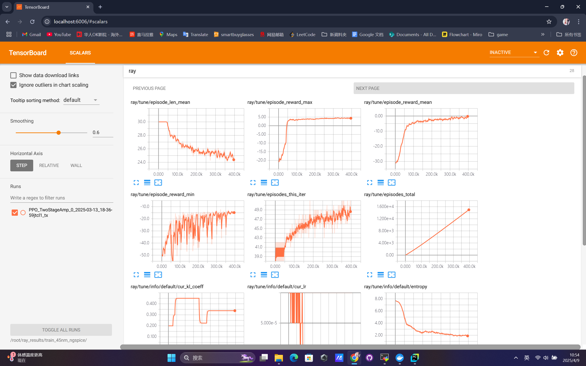
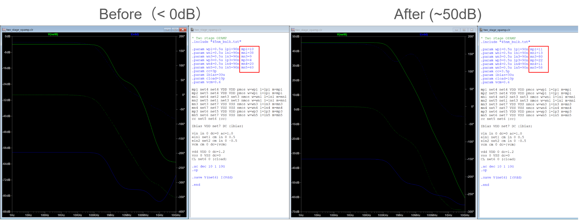

This section presents the experimental results of applying deep reinforcement learning to optimize a two-stage operational amplifier using AutoCkt and Virtuoso simulations.

## Reward Curve

The training reward curve recorded via TensorBoard reflects the learning progress of the agent. As shown below, the agent gradually learns to adjust the transistor sizing and compensation capacitor values to maximize the defined performance metric.

*Figure: TensorBoard reward curve over training epochs*

The reward shows a clear upward trend, indicating that the agent successfully explored better circuit parameter configurations over time.

## Simulation Results Before vs. After Optimization

To evaluate the effectiveness of the learned parameters, we compare the Virtuoso simulation results before and after the optimization process.

### Optimized Parameters

| Parameter         | Before     | After      |
|------------------|------------|------------|
| Compensation Cap (Cc) | 3.0 pF     | 3.5 pF      |
| Transistor mgm | 4          | 22         |
| Transistor mload | 10         | 11         |
| Transistor min | 38          | 13         |
| Transistor mtail | 9          | 80         |
| Transistor mmir | 20          | 11         |
| Transistor mload2 | 60          | 58         |

> These values are automatically selected by the trained reinforcement learning agent to satisfy the circuit’s performance goals.

### AC Simulation Comparison

Below are the simulation plots for gain and phase margins before and after optimization.

#### Frequency Response - Before Optimization & After Optimization

The optimized circuit shows a significantly improved gain-bandwidth product and better phase margin.

## Summary

The results demonstrate that the DRL agent can effectively explore the circuit parameter space and converge to configurations that achieve higher performance, with minimal human intervention. This automation greatly accelerates the analog design workflow and reduces reliance on expert heuristics.
