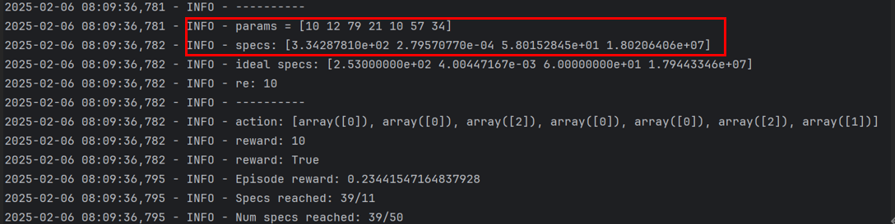
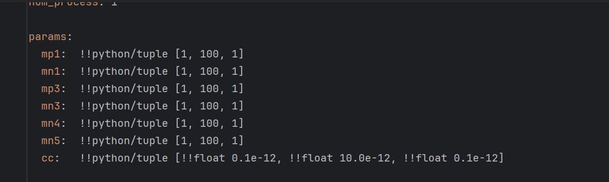
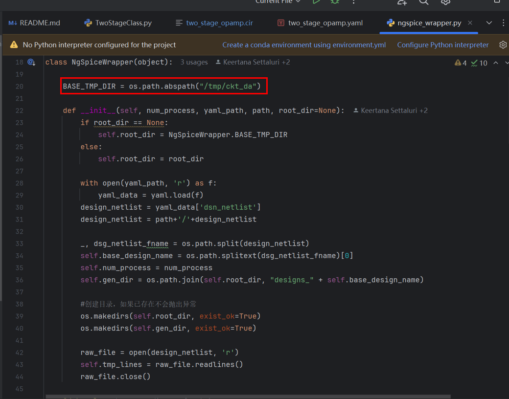
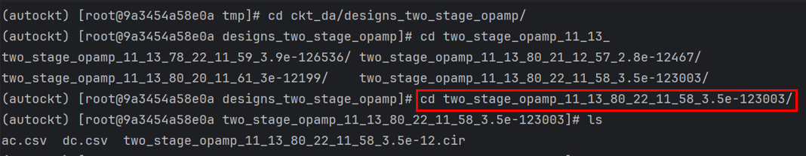

### Find the netlist corresponding to param
#### 1. Find a set of params that succeeded during the validation process

Params = [10 12 79 21 10 57 34]

#### 2. The params output here is index, and the actual value is calculated according to the specification range in `two_stage_opamp.yaml`

The first 6 are: $1 + 1 \times x$, the last one is: $(0.1 + 0.1 \times x)\times 10^{-12}$

So the final params = [11 13 80 22 11 58 3.5e-12]
#### 3. According to ngspice_wrapper.py, the changed netlist exists in the `BASE_TMP_DIR` path:

#### 4. Enter `/tmp/ckt_da/designs_two_stage_opamp/`, enter `cd two_stage_opamp_` + the params just calculated, and you can enter the corresponding path:

> The Cir file is opened to get the netlist parameters. Its file name and path name are generated using the **actual value of params**.
{: .block-tip }